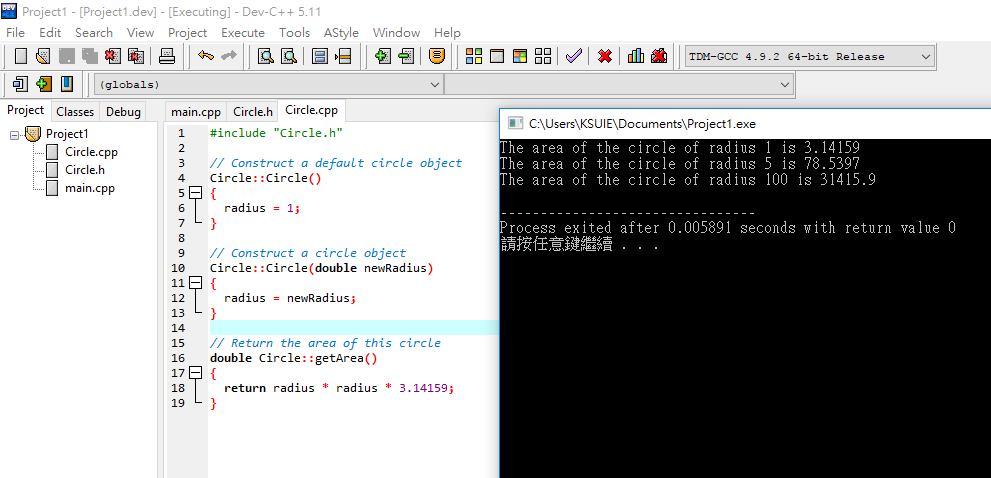

# class(類別) and object(物件)

[範例說明:圓形物件與面積](https://github.com/MyDearGreatTeacher/CPP/blob/master/20180424/TestCircle.cpp)

程式架構
```
[1]載入相關模組
[2]使用(標準)命名空間

[3]建立類別class
類別class包括
[3.1]屬性attribute:
[3.2]建構子(CONSTRUCTOR):兩個(含預設建構子DEFAULT)
[3.3]方法(METHOD/FUNCTION):

[4]main函式
[4.1]用類別class建立三個物件
[4.2]利用**物件.方法**及**物件.屬性**來執行運算
物件.屬性==>circle2.radius
物件.方法==>circle2.getArea()
```

[作業:球物件與體積及表面積]Sphere, getVolume 體積, getArea表面積

# 球體表面積


```
#include <iostream>
using namespace std;

class Sphere
{
public:
  // The radius of this circle
  double radius;

  // Construct a default circle object
  Sphere()
  {
    radius = 1;
  }

  // Construct a circle object
  Sphere(double newRadius)
  {
    radius = newRadius;
  }

  // Return the area of this circle
  double getArea()
  {
    return radius * radius * 3.14159*4;
  }
};  // Must place a semicolon here

int main()
{
  Sphere sphere1(1.0);
  Sphere sphere2(25);
  Sphere sphere3(125);

  cout << "The area of the circle of radius "
    << sphere1.radius << " is " << sphere1.getArea() << endl;
  cout << "The area of the circle of radius "
    << sphere2.radius << " is " << sphere2.getArea() << endl;
  cout << "The area of the circle of radius "
    << sphere3.radius << " is " << sphere3.getArea() << endl;

  // Modify circle radius
  sphere2.radius = 100;
  cout << "The area of the circle of radius "
    << sphere2.radius << " is " << sphere2.getArea() << endl;

  return 0;
}
```
# 球體體積

```
#include <iostream>
using namespace std;

class Sphere
{
public:
  // The radius of this circle
  double radius;

  // Construct a default circle object
  Sphere()
  {
    radius = 1;
  }

  // Construct a circle object
  Sphere(double newRadius)
  {
    radius = newRadius;
  }

  // Return the area of this circle
  double volume()
  {
    return 4.0/3.0*radius*radius*radius * 3.14159*4.0;
  }
};  // Must place a semicolon here

int main()
{
  Sphere sphere1(1.0);
  Sphere sphere2(25);
  Sphere sphere3(125);

  cout << "The Volume of the circle of radius "
    << sphere1.radius << " is " << sphere1.volume() << endl;
  cout << "The Volume of the circle of radius "
    << sphere2.radius << " is " << sphere2.volume() << endl;
  cout << "The Volume of the circle of radius "
    << sphere3.radius << " is " << sphere3.volume() << endl;

  // Modify circle radius
  sphere2.radius = 100;
  cout << "The area of the circle of radius "
    << sphere2.radius << " is " << sphere2.volume() << endl;

  return 0;
}
```





