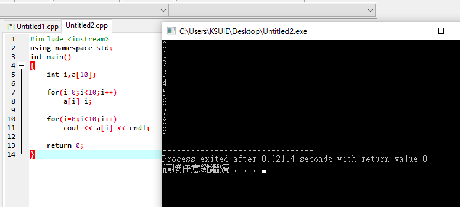
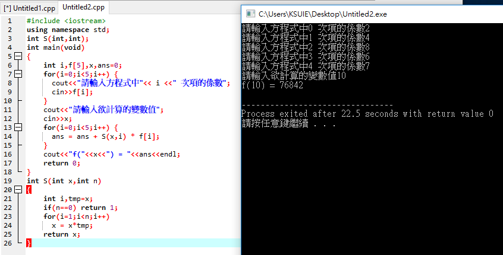
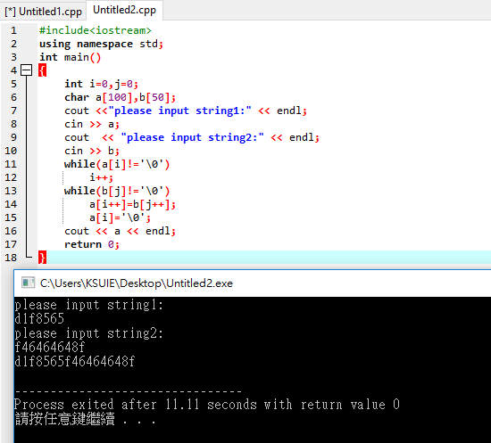
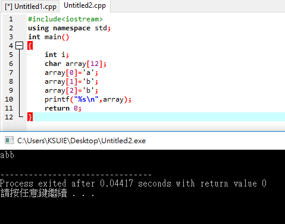
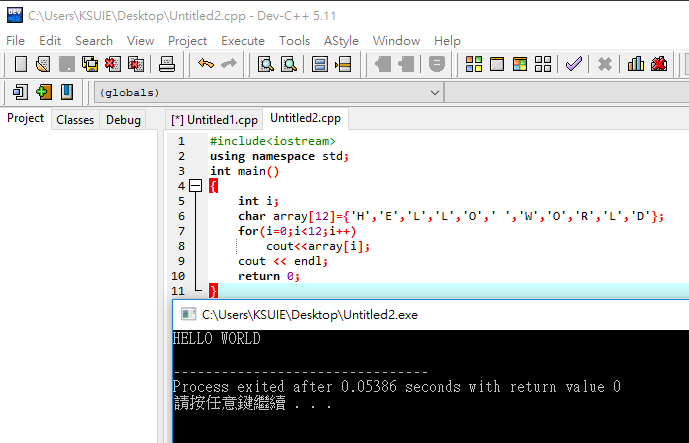
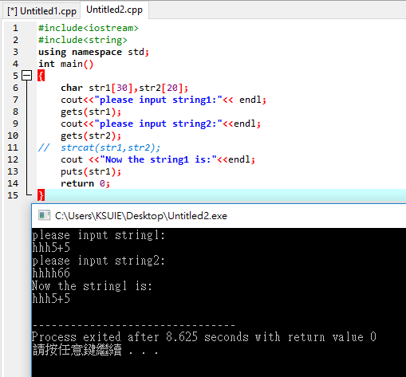

```
執行並說明下列程式的功能

```

### ex.array_1:(2018.4.17)
```
#include <iostream>
using namespace std;
int main()
{
	int i,a[10];

	for(i=0;i<10;i++)
		a[i]=i;

	for(i=0;i<10;i++)
		cout << a[i] << endl;
		
    return 0;
}
```



### ex.array_2:多項式函示求值
```
#include <iostream>
using namespace std;
int S(int,int);
int main(void)
{
    int i,f[5],x,ans=0;
    for(i=0;i<5;i++) {
      cout<<"請輸入方程式中"<< i <<" 次項的係數";
      cin>>f[i];
    }
    cout<<"請輸入欲計算的變數值";
    cin>>x;
    for(i=0;i<5;i++) {
      ans = ans + S(x,i) * f[i];
    }
    cout<<"f("<<x<<") = "<<ans<<endl;
    return 0; 
}
int S(int x,int n)
{
    int i,tmp=x;
    if(n==0) return 1;
    for(i=1;i<n;i++)
      x = x*tmp;
    return x;  
}
```



### 字串組合
```
#include<iostream>
using namespace std;
int main()
{
	int i=0,j=0;					
	char a[100],b[50];					
	cout <<"please input string1:" << endl;
	cin >> a;					
	cout  << "please input string2:" << endl;
	cin >> b;				
	while(a[i]!='\0')			
		i++;
	while(b[j]!='\0')				
		a[i++]=b[j++];			
		a[i]='\0';				
	cout << a << endl;			
    return 0;
}

```

### ex.string_array_1:
```
#include<iostream>
using namespace std;
int main()
{
	int i;
	char array[12];
	array[0]='a';
	array[1]='b';
	array[2]='b';
	printf("%s\n",array);
    return 0;
}
```

### ex.string_array_2:
```
#include<iostream>
using namespace std;
int main()
{
	int i;
	char array[12]={'H','E','L','L','O',' ','W','O','R','L','D'};
	for(i=0;i<12;i++)
		cout<<array[i];
	cout << endl;
    return 0;
}

```


### ex.string_array_3:
```
#include<iostream>
#include<string>
using namespace std;
int main()
{
	char str1[30],str2[20];
	cout<<"please input string1:"<< endl;
	gets(str1);
	cout<<"please input string2:"<<endl;
	gets(str2);
//	strcat(str1,str2);
	cout <<"Now the string1 is:"<<endl;
	puts(str1);
    return 0;
}
```



### ex.array_2d_1:(2018.4.17)
```
#include <iostream>
#include <iomanip>
using namespace std;
int fun(int array[3][3])
{
	int i,j,t;
	for(i=0;i<3;i++)
		for(j=0;j<i;j++)
		{
			t=array[i][j];
			array[i][j]=array[j][i];
			array[j][i]=t;
		}
		return 0;
}
int main()
{
	int i,j;
	int array[3][3]={{1,2,3},{4,5,6},{7,8,9}};
	cout << "Converted Front" <<endl;
	for(i=0;i<3;i++)
	{
		for(j=0;j<3;j++)
			cout << setw(7) << array[i][j] ;
		cout<< endl;
	}
	fun(array);
	cout << "Converted result" <<endl;
	for(i=0;i<3;i++)
	{
		for(j=0;j<3;j++)
			cout << setw(7) << array[i][j] ;
		cout<< endl;
	}
    return 0;
}
```


### ex.array_1:
```

```
