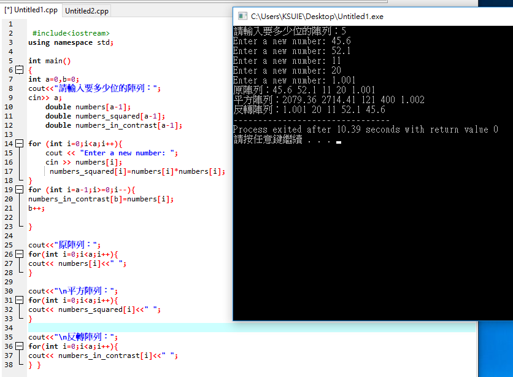
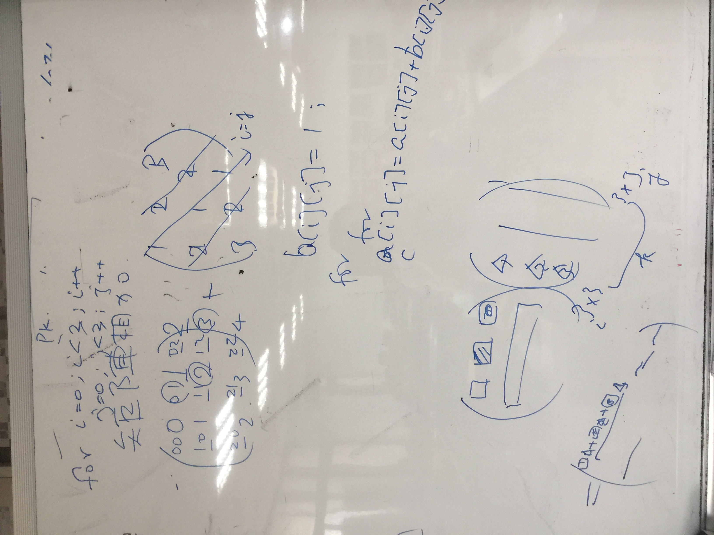
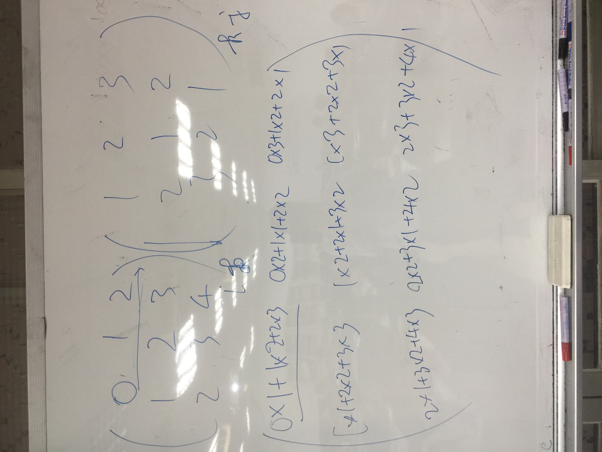

```
#include <iostream>
using namespace std;

int main()
{
  const int NUMBER_OF_ELEMENTS = 2;
  double numbers[NUMBER_OF_ELEMENTS];//創建一個欄位三的倍經度浮點數陣列
  double numbers_squared[NUMBER_OF_ELEMENTS];
  double sum = 0;

  for (int i = 0; i < NUMBER_OF_ELEMENTS; i++)//用迴圈方式逐一輸入數
  {
    cout << "Enter a new number: ";
    cin >> numbers[i];
    sum += numbers[i];//計算輸入數的加總
    numbers_squared[i]=numbers[i]*numbers[i];//把輸入數的平方丟到另一個陣列
  }
  cout << "numbers[1] is " << numbers[1] << endl;
  cout << "numbers_squared[1] is " << numbers_squared[1] << endl;
  
  double average = sum / NUMBER_OF_ELEMENTS;//計算輸入數的平方

  int count = 0; // The number of elements above average
  for (int i = 0; i < NUMBER_OF_ELEMENTS; i++)
    if (numbers[i] > average)//計算大於平方的數有多少
      count++;

  cout << "Average is " << average << endl;//輸出平方
  cout << "Number of elements above the average " << count << endl;
  system("pause"); 
  return 0;
}


```
```
說明:
numbers_squared[i]=numbers[i]*numbers[i];
計算輸入數的平方，並丟給numbers_squared 陣列

```

###### exercise1:陣列存取與基本運算
```
把一個陣列元素全部都平方存到另一個陣列
把一個陣列元素全部都反轉存到另一個陣列
```
```
#include<iostream>
using namespace std;

int main()
{
int a=0,b=0;
cout<<"請輸入要多少位的陣列：";
cin>> a; 
	double numbers[a-1];
	double numbers_squared[a-1];
	double numbers_in_contrast[a-1];
	
for (int i=0;i<a;i++){
	cout << "Enter a new number: ";
    cin >> numbers[i];
	 numbers_squared[i]=numbers[i]*numbers[i];
}
for (int i=a-1;i>=0;i--){
numbers_in_contrast[b]=numbers[i];
b++;

}

cout<<"原陣列：";
for(int i=0;i<a;i++){
cout<< numbers[i]<<" ";
}

cout<<"\n平方陣列：";
for(int i=0;i<a;i++){
cout<< numbers_squared[i]<<" ";
}

cout<<"\n反轉陣列：";
for(int i=0;i<a;i++){
cout<< numbers_in_contrast[i]<<" ";
} } 
```



### exercise2:程式閱讀題

```


```
### exercise3:矩陣相加與矩陣相乘


關鍵程式技術:自動產生元素的矩陣



關鍵程式技術:矩陣相乘



```
