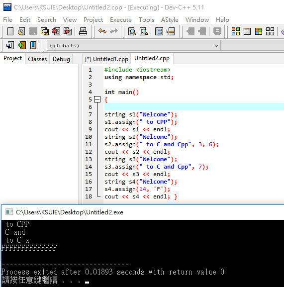

#### assing用法
說明:替換字串~~
```
#include <iostream>
using namespace std;

int main()
{

string s1("Welcome");
s1.assign(" to CPP"); //替換全部
cout << s1 << endl; 
string s2("Welcome");
s2.assign(" to C and Cpp", 3, 6); //從第四位開始，替換六個字元上去
cout << s2 << endl;
string s3("Welcome");
s3.assign(" to C and Cpp", 7); //把0-7位的字串替換上去
cout << s3 << endl; 
string s4("Welcome"); 
s4.assign(14, 'F'); //替換成14個F
cout << s4 << endl; }
```


