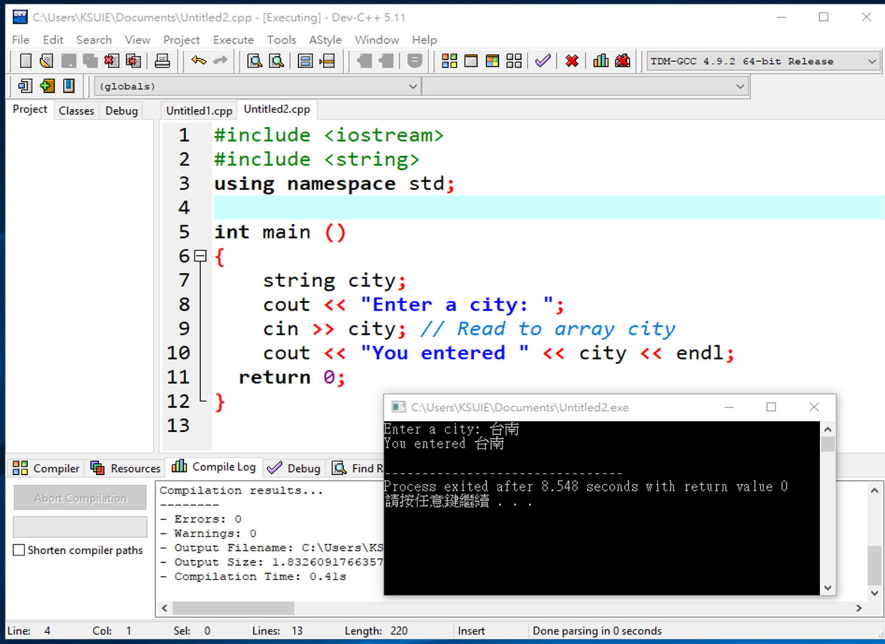

# C++ 的 string 類別

建立字串

>* https://www.byvoid.com/zht/blog/cpp-string
>* http://www.cplusplus.com/reference/string/string/
>* https://openhome.cc/Gossip/CppGossip/string2.html

# 字串的處理(功能)

>* 字串的附加
>* 指定(assign)一字串
>* at、clear、erase 以及 empty 函式
>* length、size、capacity 以及 c_str() 函式
>* 字串比較
>* 取得子字串
>* 字串搜尋(find)
>* 插入字串與取代字串
>* 字串運算子
>* 數值轉換為字串
>* 字串分割
>* 字串合併
>* 從螢幕讀取字串

### 字串的附加
```
#include <iostream>
using namespace std;

int main()
{
  string s1("Welcome");
  s1.append(" to CPP"); 
  cout << s1 << endl; 
}
```
```
string s1("Welcome");
s1.append(" to CPP"); 
cout << s1 << endl; 
```
```
string s2("Welcome");
s2.append(" to C and Cpp", 3, 6); 
cout << s2 << endl;
```
```
string s3("Welcome");
s3.append(" to C and Cpp", 7); 
cout << s3 << endl; 
```
```
string s4("Welcome"); 
s4.append(14, 'F'); 
cout << s4 << endl; 
```

```
[自我學習]
http://www.cplusplus.com/reference/string/string/append/
```

```
#include <iostream>
#include <string>

int main ()
{
  std::string str;
  std::string str2="Writing ";
  std::string str3="print 10 and then 5 more";

  // used in the same order as described above:
  str.append(str2);                       // "Writing "
  str.append(str3,6,3);                   // "10 "
  str.append("dots are cool",5);          // "dots "
  str.append("here: ");                   // "here: "
  str.append(10u,'.');                    // ".........."
  str.append(str3.begin()+8,str3.end());  // " and then 5 more"
  str.append<int>(5,0x2E);                // "....."

  std::cout << str << '\n';
  return 0;
}
```
### 從螢幕讀取字串
```
string city;
cout << "Enter a city: ";
cin >> city; // Read to array city
cout << "You entered " << city << endl;
```




```
string city;
cout << "Enter a city: ";
getline(cin, city, '\n'); // Same as getline(cin, city)
cout << "You entered " << city << endl;
```

[作業2]從螢幕輸入姓名學號要顯示姓名學號

```

```


```

```
